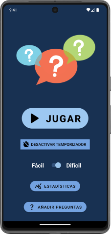
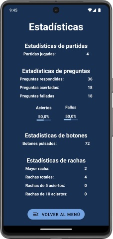

# Questions
Questions is a 'true or false' questions app. It has timer, difficulty, statistics, random questions, possibility to add new questions and local persistence.

It was built in Kotlin using Android Studio.

> [!NOTE]  
> This app was made when I was a student and had a tight deadline, so don't expect quality code. 

# Images

